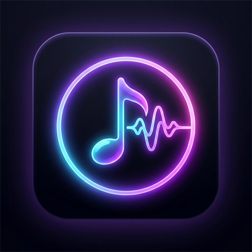

<div align="center">



# AuraMusic

### Next-generation YouTube Music client for Android with studio-grade Automix DJ transitions, Android Auto live lyrics, and AI diagnostics.

<br/>

[](https://github.com/iammrwrath/AuraMusic/releases)
[](https://github.com/iammrwrath/AuraMusic/blob/main/LICENSE)
[](https://github.com/iammrwrath/AuraMusic/releases)

<br/>

[**Download**](#-download) · [**Features**](#-features) · [**Framework Credits**](#-framework-credits--acknowledgments) · [**Troubleshooting & Bug Reports**](#-support--bug-reports) · [**License**](#-license)

</div>

---

> [!WARNING]
> ### ⚠️ Project Status: Personal Project & Active Maintenance
> **AuraMusic** is maintained primarily as a personal project by [@iammrwrath](https://github.com/iammrwrath) for personal daily use and active testing.
> - **Expect Bugs & Breaking Changes**: Features are actively being iterated on and maintained. There will be bugs and quirks.
> - **Report Defects**: If you encounter issues or crashes, please use the in-app **AI Diagnostic Reporter** (under Settings → About) or [open an issue](https://github.com/iammrwrath/AuraMusic/issues).

---

## 🎧 Features

### 🎚️ Studio-Grade Automix (DJ Transitions)
* **Constant Equal-Power Blending**: Sinusoidal $\sin^2(t) + \cos^2(t) \equiv 1.0$ volume curves guarantee continuous acoustic energy with zero volume dip between tracks.
* **Adaptive Duration Scaling**: Dynamically scales crossfade length according to track duration (up to 15% cap) for punchy transitions on shorter songs and expansive blends on longer tracks.
* **Smart Cue-In Intro Trimming**: Skips generic encoder silence (~200ms) on incoming tracks so beats drop seamlessly on the downbeat.
* **Bass-Swap Crossover**: Automatically rolls off outgoing low frequencies past the 55% mark of transitions to eliminate low-end muddiness and kick clashes.
* **Granular Volume Steps**: 30-step smooth volume ramp (increased from 20) with recycled ExoPlayer engine for artifact-free fading.

### 🚗 Android Auto Live Karaoke Lyrics
* **Car Head Unit Projection**: Real-time synchronized lyrics stream directly onto car displays via the MediaSession subtitle field.
* **Smart Interlude Indicators**: Displays `🎤 [Lyrics]` during vocals and `🎵 [Instrumental]` or `🎵 [Intro]` during musical pauses.
* **1-Tap In-Car Control**: Dedicated lyrics toggle button in car playback controls.
* **Optimized Local Caching**: Queries offline Room DB cache first before falling back to network providers.

### ⚡ 120Hz Ultra-Smooth Interface
* **High Refresh Rate Support**: Seamlessly enables 120Hz/90Hz display modes for buttery-smooth animations.
* **Virtualized Lazy Lists**: Memoized Compose keys across all song, album, and playlist queues to eliminate frame drops and stutter.
* **High-Efficiency Bitmap Cache**: Expanded in-memory Coil image caching for instantaneous thumbnail rendering.

### 🤖 Flight Recorder & Autonomous AI Diagnostics
* **1-Tap Bug Reporting**: Automatically collects device metadata, playback states, and recent session logs into a pre-formatted GitHub issue.
* **Self-Healing CI Integration**: Automated AI triage and code analysis for bug reports filed in the repository.

### 🎵 Core Music & Audio Capabilities
* **YouTube Music Streaming**: Stream any song, video, or podcast directly with background playback and screen-off listening.
* **Offline Downloads**: High-quality caching and downloading for offline listening.
* **Synced & Translated Lyrics**: Real-time word-by-word synced lyrics and AI-powered translation.
* **Audio Processing**: ReplayGain audio normalization, equalizer, sleep timer, and tempo/pitch adjustment.
* **Material You Theming**: Dynamic theme engine matching system wallpaper plus 19 preset color schemes with OLED Black mode.
* **Privacy-First**: No ads, no telemetry, no tracking.

---

## 📲 Download

<div align="center">

<br/>

### [⬇️ Download AuraMusic.apk (Universal)](https://github.com/iammrwrath/AuraMusic/releases/latest/download/AuraMusic.apk)
*Compatible with all Android devices (`arm64-v8a`, `armeabi-v7a`, `x86_64`)*

<br/>

</div>

> [!TIP]
> **In-App Updates**: AuraMusic includes a built-in auto-updater. Once installed, simply go to **Settings → Updater** to check for and install updates directly within the app!

---

## 🙏 Framework Credits & Acknowledgments

AuraMusic proudly stands on the shoulders of the open-source community. We express our deepest gratitude to the creators and maintainers of the foundational projects that made AuraMusic possible:

* **[Metrolist](https://github.com/MetrolistGroup/Metrolist)** (by Mo Agamy and contributors):  
  The core open-source Android architecture, YouTube Music streaming engine, Media3 service implementation, and Room database structure that form the bedrock of this application.
* **[BitChord](https://github.com/kushagrasinghx/BitChord)** (by Kushagra Singh):  
  Inspiration for the Automix transition paradigm and dynamic audio interface enhancements.
* **[InnerTune](https://github.com/z-huang/InnerTune)** & **[OuterTune](https://github.com/DD3Boh/OuterTune)**:  
  Pioneering open-source YouTube Music clients that originated the modern Android Compose music player design patterns.

---

## 🛠️ Build from Source

```bash
# Clone the repository
git clone https://github.com/iammrwrath/AuraMusic.git
cd AuraMusic

# Build the debug APK using Gradle and JDK 21
./gradlew :app:assembleFossDebug

# The compiled APK will be located at:
# app/build/outputs/apk/foss/debug/app-foss-debug.apk
```

---

## 💬 Support & Bug Reports

* **Maintainer**: [@iammrwrath](https://github.com/iammrwrath)
* **Bug Reports & Feature Requests**: [Open an Issue](https://github.com/iammrwrath/AuraMusic/issues)
* **Direct Email Contact**: [`iammrwrath@gmail.com`](mailto:iammrwrath@gmail.com?subject=AuraMusic%20Inquiry)

---

## 📄 License

AuraMusic is licensed under the **GNU General Public License v3.0** (GPL-3.0). See the [LICENSE](LICENSE) file for complete details.


